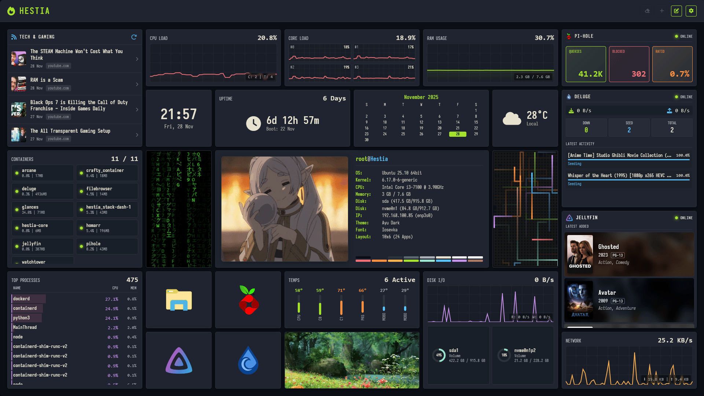

# 🔥 Project Hestia v0.1.0



Welcome to **Project Hestia**\! This is a modular, grid-based dashboard that runs entirely in the browser (no complex backend required) but includes powerful integrations for your homelab services.

This was made for personal use but as I made more features available, I thought this could be shared with anyone willing to learn how the framework operates.

Inspired by the likes of Homarr, Dash., and Homepage.

## ✨ Features

  * **🎨 Deep Theming:**
      * Full **Base16** palette support (Dracula, Nord, Monokai, etc.).
      * Customize every pixel: gap sizes, corner radii, fonts, and shadows.
      * Create and save your own custom presets directly in the UI.
  * **⚡ Snappy Grid System:**
      * Powered by the **View Transitions API** for butter-smooth animations when moving or resizing widgets.
      * Drag-and-drop layout with auto-saving.
  * **💾 Smart Persistence:**
      * **No Database Required:** Configuration saves to `localStorage`.
      * **IndexedDB Support:** Upload high-res images directly to the dashboard without hitting storage quotas.
  * **🐳 Homelab Integrations:**
      * Connects to **Glances**, **Pi-hole**, **Deluge**, and **Jellyfin**.
      * Includes a pre-configured Nginx proxy to handle CORS issues automatically.

## 📦 Included Apps

Hestia comes with a suite of built-in apps. You can add as many as you like\!

### 🏠 Essentials

  * **Clock:** Digital clock with 12h/24h formats.
  * **Weather:** Live local weather powered by [Open-Meteo](https://open-meteo.com/).
  * **Calendar:** A simple monthly view.
  * **Notes:** Sticky notes with full **Markdown** support (Lists, Checkboxes, Headers).
  * **Links:** Bookmarks with "Cover" mode and "Colorize" options to match your theme.

### 📊 Data & Homelab

  * **Glances:** Detailed server monitoring (CPU, Mem, Disk I/O, Network, Sensors). Supports Docker container lists\!
  * **Pi-hole:** View total queries, blocked count, and ratio.
  * **Deluge:** Monitor download/upload speeds and active torrent queues.
  * **Jellyfin:** Shows "Now Playing" backdrop or a shelf of "Latest Added" media.
  * **System Fetch:** A "Neofetch-style" info card for your browser or server.

### 🎨 Visuals

  * **Image Frame:** Display photos or logos (upload or URL).
  * **Matrix Rain:** The classic falling code effect.
  * **Pipes:** A retro 3D pipes screensaver widget.

-----

## 🚀 Getting Started

### Option 1: Docker (Recommended)

This is the best way to run Hestia if you plan to use the **API integrations** (Glances, Pi-hole, etc.), as the included Nginx config handles CORS permissions for you.

1.  Clone the repository:

    ```bash
    git clone https://github.com/mult1v4c/hestia-core
    cd hestia-core
    ```

2.  Build and Run:

    ```bash
    docker build -t hestia-core .
    docker run -d -p 8080:80 --name hestia hestia-core
    ```

3.  Visit `http://localhost:8080`\!

### Option 2: Static / Manual

Since Hestia is vanilla JavaScript, you can run it on any web server.

```bash
# Example using Python
python3 -m http.server 8000
```

*Note: Without the Nginx proxy included in the Dockerfile, some external APIs (like Deluge or Pi-hole) might block connections due to CORS policies.*

-----

## ⚙️ Configuration Guide

### Using the Proxy (Docker Only)

To make the integrations work smoothly, Hestia's `default.conf` sets up internal proxies. When configuring apps in the dashboard, use these relative paths:

  * **Pi-hole URL:** `/pi-api/admin/api.php` (instead of `http://192.168.x.x/...`)
  * **Deluge URL:** `/deluge-api/json`
  * **Jellyfin URL:** `/jellyfin-api/`

*Note: You will need to update `default.conf` to point to your actual server IPs before building the Docker image\!*

---

## Data Backup

You can export your entire theme and grid layout to a JSON file via the **Settings Panel** (Gear Icon). This is great for backing up your setup or sharing themes with friends\!

> [!Warning]
> **CHECK YOUR JSON FILES BEFORE SHARING!**
> The export function will export ALL of the dashboard settings, including themes, color palettes, and app data and settings. **Which means API keys, IP addresses, and passwords included**.
> I've included safeguards to clean keys, user IDs, and other sensitive information. But still check to make sure!


-----

## 🛠️ Developer Guide

Want to build your own widget? Hestia uses a simple class-based system.

1.  **Create a file:** `js/apps/myApp.js`
2.  **Extend BaseApp:**

<!-- end list -->

```javascript
import { BaseApp } from "./baseApp.js";
import { registry } from "../registry.js";

class MyApp extends BaseApp {
    // 1. Render HTML
    async render(app) {
        return `
            <div class="my-app">
                Hello ${app.data.name || 'World'}!
            </div>
        `;
    }

    // 2. Logic after DOM insertion
    onMount(el, app) {
        console.log("I am alive!");
    }
}

// 3. Register
registry.register('my-app', MyApp, {
    label: 'My Cool App',
    category: 'static',
    defaultSize: { cols: 2, rows: 1 },
    settings: [
        { name: 'name', label: 'Who to greet?', type: 'text' }
    ],
    css: `.my-app { color: var(--brand-primary); font-weight: bold; }`
});
```

3.  **Import it:** Add `import './myApp.js';` to `js/apps/appIndex.js`.

-----

## 📄 License

Project Hestia is open-source and licensed under the **MIT License**.